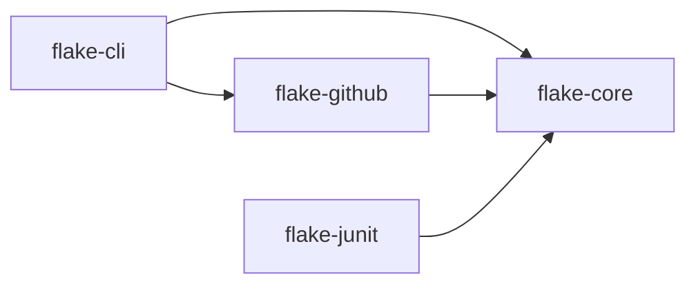

# Design

This document describes how the pieces fit together, what each class is responsible for, where to
plug in your own behaviour, and which trade-offs were made on purpose. It grows with the code; the
delivery plan at the end says what has landed.

## Modules

- **flake-core** has no I/O beyond the SQLite database and the files it is explicitly asked to
  read or write. Everything statistical lives here so it can be tested without a network.
- **flake-github** talks to the GitHub REST API with `java.net.http` and a token from
  `GITHUB_TOKEN`. It feeds the core's parser and consumes the core's scores.
- **flake-junit** is a JUnit 5 extension that enforces the quarantine ledger at test time.
- **flake-cli** wires the above into the `flake` command with picocli and is shaded into one
  executable jar.

## Packages in flake-core

| Package      | Responsibility                                                                   |
|--------------|----------------------------------------------------------------------------------|
| `model`      | Immutable value types: `TestId`, `TestRun`, `BuildRun`, `Outcome`.               |
| `ingest`     | `JUnitXmlParser` for Surefire and Failsafe XML including rerun elements; `RunSource` with `LocalDirectorySource`. |
| `store`      | `RunStore` interface and `SqliteRunStore` with numbered SQL migrations.          |
| `score`      | `FlakinessScorer` producing a `FlakeScore` per test with an `explain()`.         |
| `quarantine` | `QuarantineLedger` reading and writing `.flake/quarantine.yaml`.                 |
| `report`     | Markdown and single-file HTML reports.                                           |

## The run model

`TestRun` is one execution of one test. It points at the `BuildRun` it happened in (workflow run
id, commit, attempt number, timestamp) and adds the branch, the runner label, a rerun index, the
duration, the outcome and the failure message hash. The rerun index matters: when Surefire reruns
a failing test, every execution becomes its own `TestRun` (rerun 0, 1, 2, ...) so the scorer can
see "failed, failed, passed" on the same commit, which is the single strongest flakiness signal.
A GitHub Actions "re-run jobs" creates a new `BuildRun` with the same id and a higher attempt, so
the same signal is visible across attempts too.

`JUnitXmlParser` deliberately produces `TestCaseResult`s, which know nothing about builds, and
`TestCaseResult.toRuns(build, branch, runner)` does the tying. Parsing is pure and fixture-tested;
the build context is supplied by whoever found the file (a local directory, an Actions artifact).

## Deliberate trade-offs

- **No machine learning.** The signals that matter (a failure that passes on re-run of the same
  commit, outcomes flipping on the same commit, many distinct failure messages) are simple
  statistics. They are explainable, testable against fixtures, and reproducible in a second
  implementation (the GitHub Action in TypeScript uses the same formulas and the same fixtures).
- **SQLite, one file.** Run history lives in `.flake/history.db`. It is a single file that can be
  cached between CI runs with `actions/cache`, copied, or deleted to start over.
- **YAML ledger in the repository.** Quarantine decisions are code-reviewed like any other change
  and the history of who quarantined what, and why, is in git.
- **Expiry is mandatory.** Every ledger entry must expire within 90 days. Expired entries fail the
  build so quarantine cannot become permanent by neglect.

## Delivery plan

One commit and one green CI run per step; v1.0.0 after step 6.

1. Parent pom and modules, workflows, README problem statement. **Done.**
2. Model and `JUnitXmlParser` with fixtures covering Surefire 3 reruns. **Done.**
3. `SqliteRunStore` with migrations and `LocalDirectorySource`; `flake ingest <dir>`.
4. `FlakinessScorer` with `docs/scoring.md`; `flake score`.
5. `QuarantineLedger`, `flake quarantine` and `flake gate`.
6. Markdown and HTML report. Release v1.0.0.
7. `flake-github` ingest from Actions artifacts.
8. `flake-junit` extension.
9. PR comment and issue sync.
10. GitHub Action (TypeScript) with conformance tests.
11. Dogfood the action in this repo's CI.
12. Demo run, README table, `docs/demo-report.html`. Release v1.1.0.
