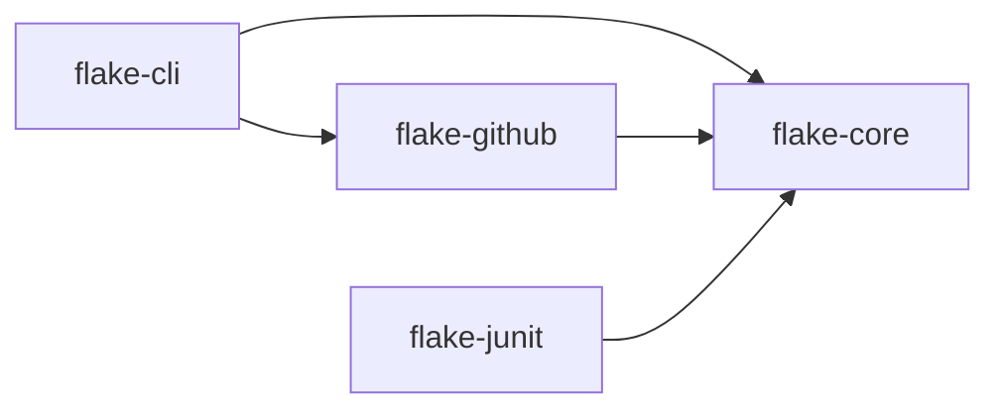

# Design

This document describes how the pieces fit together, what each class is responsible for, where to
plug in your own behaviour, and which trade-offs were made on purpose. It grows with the code; the
delivery plan at the end says what has landed.

## Modules

- **flake-core** has no I/O beyond the SQLite database and the files it is explicitly asked to
  read or write. Everything statistical lives here so it can be tested without a network.
- **flake-github** talks to the GitHub REST API with `java.net.http` and a token from
  `GITHUB_TOKEN`. It feeds the core's parser and consumes the core's scores.
- **flake-junit** is a JUnit 5 extension that enforces the quarantine ledger at test time.
- **flake-cli** wires the above into the `flake` command with picocli and is shaded into one
  executable jar.

## Packages in flake-core

| Package      | Responsibility                                                                   |
|--------------|----------------------------------------------------------------------------------|
| `model`      | Immutable value types: `TestId`, `TestRun`, `BuildRun`, `Outcome`.               |
| `ingest`     | `JUnitXmlParser` for Surefire and Failsafe XML including rerun elements; `RunSource` with `LocalDirectorySource`. |
| `store`      | `RunStore` interface and `SqliteRunStore` with numbered SQL migrations.          |
| `score`      | `FlakinessScorer` producing a `FlakeScore` per test with an `explain()`.         |
| `quarantine` | `QuarantineLedger` reading and writing `.flake/quarantine.yaml`.                 |
| `report`     | Markdown and single-file HTML reports.                                           |

## The run model

`TestRun` is one execution of one test. It points at the `BuildRun` it happened in (workflow run
id, commit, attempt number, timestamp) and adds the branch, the runner label, a rerun index, the
duration, the outcome and the failure message hash. The rerun index matters: when Surefire reruns
a failing test, every execution becomes its own `TestRun` (rerun 0, 1, 2, ...) so the scorer can
see "failed, failed, passed" on the same commit, which is the single strongest flakiness signal.
A GitHub Actions "re-run jobs" creates a new `BuildRun` with the same id and a higher attempt, so
the same signal is visible across attempts too.

`JUnitXmlParser` deliberately produces `TestCaseResult`s, which know nothing about builds, and
`TestCaseResult.toRuns(build, branch, runner)` does the tying. Parsing is pure and fixture-tested;
the build context is supplied by whoever found the file (a local directory, an Actions artifact).

## The run store

`RunStore` is a small interface (record, runs of a test, all runs, test ids, counts) with one
implementation, `SqliteRunStore`. Two tables: `builds` keyed by (id, attempt) and `test_runs`
with a unique key over (class, method, build id, attempt, rerun). Inserts use `INSERT OR IGNORE`,
which is what makes ingestion idempotent. Timestamps are stored as epoch milliseconds so ordering
is numeric.

Schema changes are numbered SQL scripts under `store/migrations/` in the jar. `Migrations` applies
every script newer than `PRAGMA user_version` inside a transaction and then bumps the version, so
an old `history.db` restored from a CI cache is upgraded on open and never rewritten by hand.

## Scoring

`FlakinessScorer` is pure: it takes a test id and a list of runs and returns a `FlakeScore` record
holding every intermediate number (counts, rates, Wilson intervals, entropy, correlations) so that
reports and explanations never recompute anything. `Wilson` and `CramersV` are small, separately
tested value types. The formulas are documented in [scoring.md](scoring.md) and pinned by
`conformance/scoring.json`, which was generated from an independent reference implementation and
is the contract the TypeScript scorer in the GitHub Action must also satisfy.

## Where a build's identity comes from

Report files carry no commit, branch or build id. `BuildContext` in the CLI resolves them, in
order: explicit option, GitHub Actions environment (`GITHUB_SHA`, `GITHUB_REF_NAME` or
`GITHUB_HEAD_REF` on pull requests, `GITHUB_RUN_ID`, `GITHUB_RUN_ATTEMPT`, `RUNNER_NAME`), git in
the working directory, and finally a default (`unknown` commit, a timestamp-based build id,
attempt 1, empty branch and runner). Other CI systems work through the explicit options.

## Quarantine and the gate

`QuarantineLedger` is an immutable value; `add`, `remove`, `find`, `isQuarantined` and `expired`
all return new state or answer a question, never mutate in place, so a ledger can be built up
programmatically (as `flake quarantine add` does) without any risk of a half-written file.
`QuarantineEntry`'s constructor is where the 90-day cap is enforced, so it holds regardless of
whether the entry came from a command or from loading a hand-edited YAML file. The YAML is written
by hand-rolled, minimal formatting rather than a general emitter, so the file `flake quarantine
add` produces is stable and diff-friendly across snakeyaml versions; parsing still goes through
snakeyaml's `SafeConstructor` so arbitrary YAML tags cannot instantiate arbitrary classes.

`flake gate` deliberately does not ingest: it reads the *current* build's reports directly with
`JUnitXmlParser` (bypassing the run store) to find this run's failures, and separately reads the
run store to score each one against history. This keeps "did this run fail" (the reports) and
"is this test known to be flaky" (the store) as two clearly separate questions; ingesting the
current run's data into history is a distinct, explicit step (`flake ingest`) so a build that is
gated but never ingested cannot silently corrupt the evidence used to gate the next one. See
[docs/quarantine.md](quarantine.md) and [docs/ci-integration.md](ci-integration.md).

## Reports

`ReportEntry` pairs a `FlakeScore` with a capped, chronological trend of outcomes; `Reports.build`
is the only place that turns a `RunStore` into report input, so `MarkdownReport` and `HtmlReport`
are pure functions of `List<ReportEntry>` and cannot disagree about what a test's history was.
`HtmlReport` writes a single file by hand (no templating engine, no external CSS or JS) so the
output has no build-time or runtime dependency beyond the JVM producing it, and can be opened or
attached to a CI run without a web server. Trend characters (`.`/`F`/`E`) and sparkline colors are
shared knowledge between the two renderers only by convention, not by a common type, which is a
small duplication accepted for keeping each renderer simple and self-contained.

## Deliberate trade-offs

- **No machine learning.** The signals that matter (a failure that passes on re-run of the same
  commit, outcomes flipping on the same commit, many distinct failure messages) are simple
  statistics. They are explainable, testable against fixtures, and reproducible in a second
  implementation (the GitHub Action in TypeScript uses the same formulas and the same fixtures).
- **SQLite, one file.** Run history lives in `.flake/history.db`. It is a single file that can be
  cached between CI runs with `actions/cache`, copied, or deleted to start over.
- **YAML ledger in the repository.** Quarantine decisions are code-reviewed like any other change
  and the history of who quarantined what, and why, is in git.
- **Expiry is mandatory.** Every ledger entry must expire within 90 days. Expired entries fail the
  build so quarantine cannot become permanent by neglect.

## Delivery plan

One commit and one green CI run per step; v1.0.0 after step 6.

1. Parent pom and modules, workflows, README problem statement. **Done.**
2. Model and `JUnitXmlParser` with fixtures covering Surefire 3 reruns. **Done.**
3. `SqliteRunStore` with migrations and `LocalDirectorySource`; `flake ingest <dir>`. **Done.**
4. `FlakinessScorer` with `docs/scoring.md`; `flake score`. **Done.**
5. `QuarantineLedger`, `flake quarantine` and `flake gate`. **Done.**
6. Markdown and HTML report. **Done.** Release v1.0.0.
7. `flake-github` ingest from Actions artifacts.
8. `flake-junit` extension.
9. PR comment and issue sync.
10. GitHub Action (TypeScript) with conformance tests.
11. Dogfood the action in this repo's CI.
12. Demo run, README table, `docs/demo-report.html`. Release v1.1.0.
